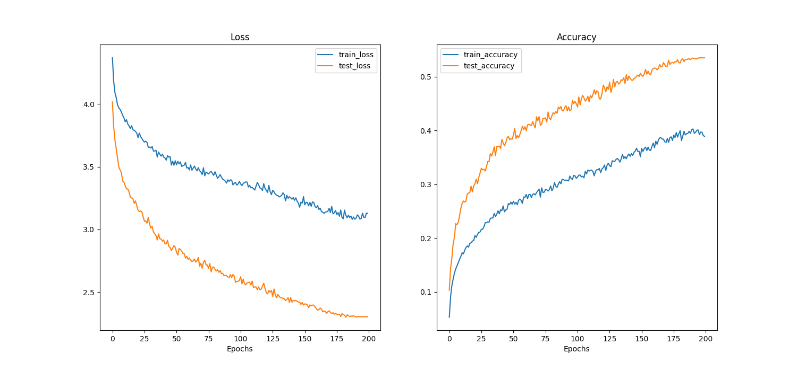

<div align="center">

# 🔭 Vision Transformer (ViT) from Scratch
### Trained on CIFAR-100 — No Pre-trained Weights. No Shortcuts.

[](https://pytorch.org)
[](https://python.org)
[](https://www.cs.toronto.edu/~kriz/cifar.html)
[](https://arxiv.org/abs/2010.11929)
[](#-results)

<br/>

> *Training a Vision Transformer from scratch on a small dataset is one of the hardest challenges in modern deep learning — Transformers have no spatial inductive biases, making severe overfitting nearly inevitable. This project solves it.*

<br/>

---

### 🎯 Final Test Accuracy: **53.5%** on 100 classes — zero pre-training, zero distillation.

---

</div>

## 🧠 The Core Challenge

CNNs come with built-in **spatial inductive biases** — translation invariance, local connectivity — that make them naturally suited to image tasks. Vision Transformers have **none of that**. Every spatial relationship must be learned from scratch via attention.

This makes training ViT from scratch on small datasets like CIFAR-100 notoriously difficult:

| Problem | Why It Happens | How This Project Solves It |
|---------|----------------|---------------------------|
| **Severe Overfitting** | No inductive bias → model memorises pixels | MixUp + CutMix destroy memorisable patterns |
| **Overconfident Predictions** | Hard labels push logits to extremes | Label Smoothing (`0.1`) softens targets |
| **Unstable Late Training** | Fixed LR causes loss oscillation | Cosine Annealing decays LR smoothly to 0 |
| **Weight Explosion** | Attention layers have huge capacity | High Weight Decay (`0.2`) via AdamW |

---

## 🏗️ Model Architecture

Built entirely from scratch using `torch.nn` — no HuggingFace, no timm, no shortcuts.

```
Input Image (3 × 32 × 32)
        │
        ▼
┌───────────────────────────────────┐
│        Patch Embedding            │
│  8×8 patches → 16 tokens         │
│  Linear projection → dim 192      │
└───────────────┬───────────────────┘
                │
        [CLS] token prepended
                │
        + Positional Embeddings (learnable)
                │
                ▼
┌───────────────────────────────────┐   ×6
│      Transformer Encoder Block    │◄──────
│                                   │
│  ┌─────────────────────────────┐  │
│  │   LayerNorm                 │  │
│  │   Multi-Head Self-Attention │  │  6 heads
│  │   (+ Dropout 0.1)           │  │
│  └──────────────┬──────────────┘  │
│        Residual │ Connection       │
│  ┌──────────────▼──────────────┐  │
│  │   LayerNorm                 │  │
│  │   MLP (dim → 4×dim → dim)   │  │
│  │   (+ Dropout 0.1)           │  │
│  └─────────────────────────────┘  │
└───────────────────────────────────┘
                │
        CLS token output
                │
                ▼
┌───────────────────────────────────┐
│      Classification Head (MLP)    │
│      dim 192 → 100 classes        │
└───────────────────────────────────┘
```

**Architecture Config:**

| Hyperparameter | Value |
|----------------|-------|
| Patch Size | 8 × 8 |
| Hidden Dimension | 192 |
| Transformer Layers | 6 |
| Attention Heads | 6 |
| Dropout (Attention + Hidden) | 0.1 |
| MLP Expansion Ratio | 4× |

---

## 🛡️ Regularisation Strategy

Training a ViT from scratch **without** a heavy regularisation scheme results in ~20-25% test accuracy due to catastrophic overfitting. Every technique below was deliberately chosen:

### 🔀 MixUp & CutMix (Batch-Level Augmentation)
Applied dynamically at batch generation via `torchvision.transforms.v2` and a custom `collate_fn`.

- **MixUp** blends two images and their labels via a Beta-distributed coefficient → `image = λ·imgA + (1−λ)·imgB`
- **CutMix** pastes a random rectangular crop from one image onto another, mixing labels proportionally to patch area

Both force the model to produce **soft probability distributions** rather than committing to hard labels — effectively destroying pixel-level memorisation capacity.

> ⚠️ **Important side effect:** Training accuracy will naturally read *lower* than test accuracy. This is expected and desirable — the model never sees clean, un-augmented training samples.

### 🏷️ Label Smoothing
```python
loss_fn = nn.CrossEntropyLoss(label_smoothing=0.1)
```
Prevents the model from becoming overconfident. Ground-truth probability is redistributed: `0.9` for the correct class, `0.1 / (C-1)` spread across all others.

### 📉 Cosine Annealing LR Schedule
```python
scheduler = torch.optim.lr_scheduler.CosineAnnealingLR(optimizer, T_max=200)
```
Smoothly decays learning rate from `3e-4` → `0` over 200 epochs. Eliminates the sharp loss spikes that come with fixed or step-decay schedules in the late training phase.

### ⚖️ AdamW with High Weight Decay
```python
optimizer = torch.optim.AdamW(model.parameters(), lr=3e-4, weight_decay=0.2)
```
Decoupled weight decay (AdamW) prevents the adaptive gradient scaling of Adam from undermining regularisation — a critical distinction from vanilla `Adam + L2`.

---

## 📊 Results

Trained for **200 epochs** on CIFAR-100 (50,000 training images, 100 classes).

| Metric | Value |
|--------|-------|
| 🎯 **Final Test Accuracy** | **~53.5%** |
| 📉 **Final Test Loss** | ~2.30 |
| 🏋️ **Training Epochs** | 200 |
| 🔧 **Pre-trained Weights** | None |
| 🧪 **Distillation** | None |



> **Why is train accuracy lower than test accuracy?**
> MixUp and CutMix apply to training batches only. The model is evaluated on clean test images it has never seen in their unaltered form — producing this characteristic "inverted" accuracy gap that signals **excellent generalisation**, not a bug.

**Context:** Achieving >50% on CIFAR-100 with a pure scratch-trained ViT (no distillation, no massive pre-training corpus) is a strong result. The original ViT paper itself noted that Transformers underperform CNNs on small datasets without pre-training — this project directly addresses that limitation.

---

## 📁 Project Structure

```
├── config.py          # Central hyperparameter config dictionary
│                      # (patch size, hidden dim, heads, lr, batch size, etc.)
│
├── data_setup.py      # DataLoader setup with v2 transforms + custom
│                      # collate_fn for dynamic MixUp/CutMix generation
│
├── model.py           # Full ViT architecture (PatchEmbed → Encoder → Head)
│                      # built purely from torch.nn modules
│
├── engine.py          # train_step() / test_step() — handles soft labels
│                      # from MixUp/CutMix dynamically
│
├── train.py           # Main entry point: initialise model, dataloaders,
│   train_test.py      # optimizer, scheduler, and run training loop
│
├── utils.py           # Loss & accuracy curve visualisation helpers
│
└── training_results.png  # Generated output plots
```

---

## 🚀 Usage

### Install Dependencies

```bash
pip install torch torchvision torchmetrics matplotlib tqdm einops
```

### Train the Model

```bash
python train.py
```

All hyperparameters are controlled from `config.py` — no need to touch training code:

```python
# config.py
CONFIG = {
    "patch_size": 8,
    "hidden_size": 192,
    "num_hidden_layers": 6,
    "num_attention_heads": 6,
    "hidden_dropout_prob": 0.1,
    "attention_probs_dropout_prob": 0.1,
    "batch_size": 512,
    "learning_rate": 3e-4,
    "weight_decay": 0.2,
    "num_epochs": 200,
}
```

---

## 📚 References

- [**An Image is Worth 16x16 Words**](https://arxiv.org/abs/2010.11929) — Dosovitskiy et al., 2020 (Original ViT Paper)
- [**MixUp: Beyond Empirical Risk Minimization**](https://arxiv.org/abs/1710.09412) — Zhang et al., 2017
- [**CutMix: Training Strategy**](https://arxiv.org/abs/1905.04899) — Yun et al., 2019
- [**Decoupled Weight Decay Regularization (AdamW)**](https://arxiv.org/abs/1711.05101) — Loshchilov & Hutter, 2017

---

<div align="center">

*Proving that Transformers can learn vision — even without the shortcuts.*

</div>
